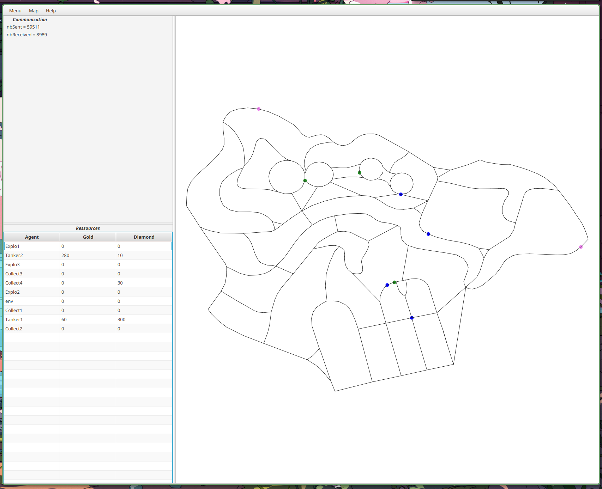

# ✨ IMAS MULTI-AGENT SYSTEMS ✨


MAS (Integrated Multi-Agent Systems) is a software platform for developing multi-agent systems. It is based on the JADE (Java Agent DEvelopment Framework) platform and provides a set of tools and libraries for building agent-based systems.

In a multi-agent system, multiple agents interact with each other and with their environment to achieve a common goal or solve a problem. Each agent is a self-contained software entity that can act independently and communicate with other agents. The agents in a multi-agent system are typically distributed and communicate with each other using a message-passing model.

# ✨Treasure hunt problem✨

### Types of agents available

#### Explorers
The primary objective of Explorers is to navigate and survey the environment. They can collaborate with other explorers to create a comprehensive map of the area. While they possess strong lock-picking skills, they are not able to collect treasures.

#### Collectors
Collectors are focused on transporting the treasures that have been collected. They have the ability to carry a large number of treasures, but lack the capability to collect or unlock safes.

#### Tankers
Tankers are designed to gather treasures, with a limited capacity backpack for carrying either gold or diamonds. They can accumulate as many treasures as their backpack allows. When in communication range with another Tanker, they can transfer the contents of their backpack. Tankers have limited safe-cracking abilities.


## 🚀 Getting Started

These instructions will get you a copy of the project up and running on your local machine for development and testing purposes. See deployment for notes on how to deploy the project on a live system.

### 🌱 Prerequisites

What things you need to install the software and how to install them

- IntelliJ IDEA https://www.jetbrains.com/idea/


### 🛠️ Installation Steps 
1.Clone the repository

```
git clone https://github.com/EjbejaranosAI/IMAS.git
```

2. For each OS:
- For MacOs
```
Hombrew install jdk
```

```
Hombrew install maven
```

- For Windows

- For Linux

```
sudo apt install maven
```

```
sudo tar -xzf jetbrains-toolbox-1.17.7391.tar.gz -C /opt
```

Execute the jetbrains-toolbox binary from the extracted directory to run the Toolbox App.

Next of this, install the Jdk appropiate for your machine:

Builds

[Linux/AArch64](https://download.java.net/java/GA/jdk18.0.2.1/db379da656dc47308e138f21b33976fa/1/GPL/openjdk-18.0.2.1_linux-aarch64_bin.tar.gz.sha256)

[Linux/x64](https://download.java.net/java/GA/jdk18.0.2.1/db379da656dc47308e138f21b33976fa/1/GPL/openjdk-18.0.2.1_linux-x64_bin.tar.gz)

[macOS/AArch64](https://download.java.net/java/GA/jdk18.0.2.1/db379da656dc47308e138f21b33976fa/1/GPL/openjdk-18.0.2.1_macos-aarch64_bin.tar.gz)

[macOS/x64](https://download.java.net/java/GA/jdk18.0.2.1/db379da656dc47308e138f21b33976fa/1/GPL/openjdk-18.0.2.1_macos-x64_bin.tar.gz)

[Windows/x64](https://download.java.net/java/GA/jdk18.0.2.1/db379da656dc47308e138f21b33976fa/1/GPL/openjdk-18.0.2.1_windows-x64_bin.zip)

### 💻 Run the code

Go for your terminal and write the following commands

```
cd dedale-etu
```

```
mvn install java exec:
```


### 💻 Some Demo examples
#### Rio: the big map
This demo shows the general picture of how all agents combined behave in a real world scenario map. In this case this is a residential are from Rio de Janeiro. This can be further explored executing the main branch.

https://user-images.githubusercontent.com/48654069/211533953-f39a0edf-bcde-422d-ba9b-56016bc33dda.mp4

After some iterations, the agents are able to collect all the treasures present in the map. It would look like the following:




#### Backoff mechanism of collectors
This demo demonstrates how collectors can backoff when they collide between them during a mission. Since they cannot improvise (no map knowledge), one of them needs to backtrack his path until he finds a node of escape and allow that way to the other collector to move on in his mission.

This can be reproduced executing the "conflict_demo".

https://user-images.githubusercontent.com/48654069/211534021-9f908355-c21c-4e30-8a16-4dd0018ad882.mp4


#### Mission workflow on simplified map
This demo shows how useful it can be, in a final stage where only one treasure is left to finish the problem, to have a mission mechanism. The diamond collector finds the diamond treasure (which he cannot collect in one go) and the explorers tell him the shortest path to it every time they cross paths.

This can be reproduced executing the "conflict_demo".

https://user-images.githubusercontent.com/48654069/211534073-6b375e66-321a-4b72-82d3-f5fedc8241d1.mp4


#### Fast resolution on grid map
This is an example on how the problem is solved in a simplified map.

This can be reproduced executing the "conflict_demo".

https://user-images.githubusercontent.com/48654069/211534113-61abd842-f0a7-4545-a8bb-39bf75146068.mp4
